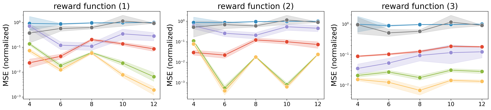
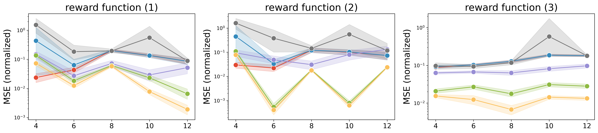
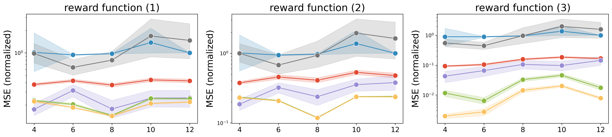
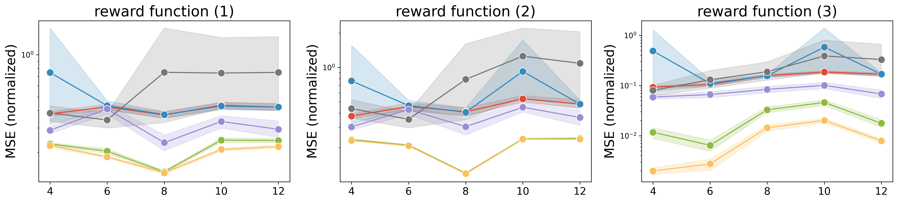
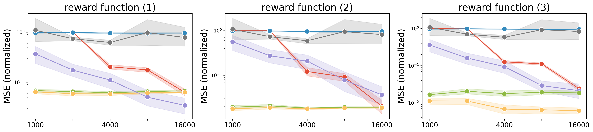
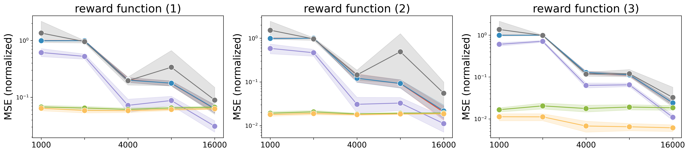
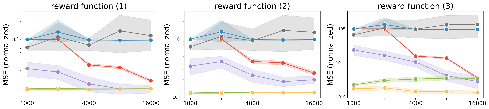
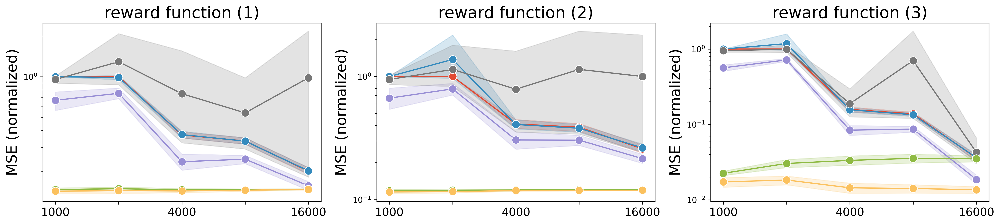

## Off-Policy Evaluation of Slate Bandit Policies via Optimizing Abstraction

---

### About
This repository contains the code to replicate the semi-synthetic experiments conducted in the paper "[Off-Policy Evaluation of Slate Bandit Policies via Optimizing Abstraction]()" by [Haruka Kiyohara](https://sites.google.com/view/harukakiyohara), Masahiro Nomura, and [Yuta Saito](https://usait0.com/en/), which has been accepted to [WebConf2024](https://www2024.thewebconf.org/). 
<!-- [[paper]()] [[arXiv]()] [[slide]()] -->

<details>
<summary><strong>Click here to show the abstract </strong></summary>

We study *off-policy evaluation* (OPE) in the slate contextual bandits where a policy selects multi-dimensional actions known as slates. This problem is widespread in recommender systems, search engines, to marketing promotions, however, the typical Inverse Propensity Scoring (IPS) estimator suffers from substantial variance due to large action spaces, making effective OPE a significant challenge. The PseudoInverse (PI) estimator has been introduced to mitigate variance by assuming linearity in the reward function, but this can result in significant bias as this assumption is hard-to-verify from observed data and is often substantially violated. To address the limitations of previous estimators, we develop a novel estimator for OPE of slate bandits, called *Latent IPS* (LIPS), which defines importance weights in the low-dimensional slate abstraction space where we optimize slate abstractions to minimize the bias and variance of LIPS in a data-driven way. By doing so, LIPS can substantially reduce the variance of IPS without imposing restrictive assumptions on the reward function structure like linearity. Through experiments, we demonstrate that LIPS substantially outperforms existing estimators, particularly in scenarios with non-linear rewards and large slate spaces.

</details>

If you find this code useful in your research then please site:
```
@inproceedings{kiyohara2024off,
  author = {Kiyohara, Haruka and Nomura, Masahiro and Saito, Yuta},
  title = {Off-Policy Evaluation of Slate Bandit Policies via Optimizing Abstraction},
  booktitle = {Proceedings of The 2024 ACM Web Conference},
  pages = {xxx-xxx},
  year = {2024},
}
```

### Dependencies
This repository supports Python 3.7 or newer.

- numpy==1.22.4
- pandas==1.5.3
- scikit-learn==1.0.2
- matplotlib==3.7.1
- torch==2.0.0
- hydra-core==1.3.2

### Running the code
To conduct the semi-synthetic experiments with Eurlex-4K, Wiki10-31K, and Delicious, run the following commands.

(i) run OPE with LIPS and IPS-based estimators with varying slate sizes, with the fixed data size.
```bash
python real/main_ips.py setting=slate_size setting.dataset={eurlex/wiki/delicious} setting.reward_function_type={additive/discount/minmax}
```

(ii) run OPE with LIPS and DR-based estimators with varying slate sizes, with the fixed data size.
```bash
python real/main_dr.py setting=slate_size setting.dataset={eurlex/wiki/delicious} setting.reward_function_type={additive/discount/minmax}
```

(iii) run OPE with LIPS and IPS-based estimators with varying data sizes, with the fixed slate size.
```bash
python real/main_ips.py setting=data_size setting.dataset={eurlex/wiki/delicious} setting.reward_function_type={additive/discount/minmax}
```

(iv) run OPE with LIPS and DR-based estimators with varying data sizes, with the fixed slate size.
```bash
python real/main_dr.py setting=data_size setting.dataset={eurlex/wiki/delicious} setting.reward_function_type={additive/discount/minmax}
```

Once the code is finished executing, you can find the results (`estimation_data_size.csv`, `estimation_slate_size.csv`) in the `./logs/{eurlex/wiki/delicious}/{additive/discount/minmax}/` directory.

### Visualize the results
To visualize the results, run the following commands after running the experiment.

```bash
python real/visualize.py setting=visualization setting.experiment={slate_size/data_size} setting.dataset={eurlex/wiki/delicious} setting.baseline_type={ips/dr}
```

Then, you will find the following figures (`{data/slate}_size_{eurlex/wiki/delicious}_{ips/dr}_mse.png`) in the `./logs/figs/` directory. A lower value is better for MSE (normalized) (y-axis).

The reward functions (i), (ii), and (iii) correspond to "additive", "discount", and "minmax", respectively.

### labels

(ips)

  

(dr)
  

#### slate size

- eurlex 

(ips)

  

(dr)

  

- wiki

(ips)

  

(dr)

  


#### data size

- eurlex 

(ips)

  

(dr)

  

- wiki

(ips)

  

(dr)

  
